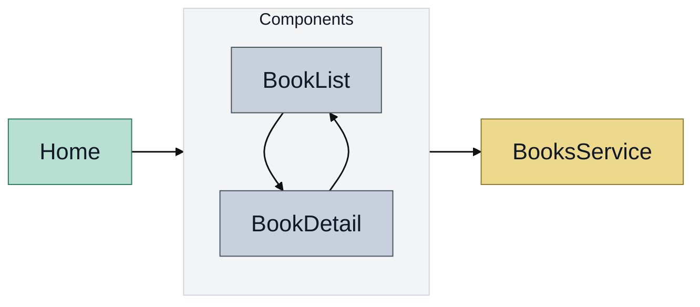

# Welcome to React Router!

A minimal template for experimenting with React Router v7.

[](https://stackblitz.com/github/remix-run/react-router-templates/tree/main/minimal)

> ![NOTE]
> This template should not be used for production apps and is intended more for experimentation and demo applications. Please see the [default](https://github.com/remix-run/react-router-templates/tree/main/default) template for a more full-featured template.

## Getting Started

### Installation

Install the dependencies:

```bash
npm install
```

### Development

Start the development server with HMR:

```bash
npm run dev
```

Your application will be available at `http://localhost:5173`.

---

Built with ❤️ using React Router.

## Diagrama de elementos


